# 🚀 ResuMaxxing Architecture & System Design

> **The Industrial-Grade AI Career Engine.**  
> ResuMaxxing is an automated, AI-driven career operating system designed for high-velocity resume tailoring, job application tracking, and automated document generation.

---

## 📌 Executive Summary & Architecture Overview

ResuMaxxing follows a decoupled **Client-Server & Micro-service Ready Architecture**:
- **Frontend Layer:** Built with **Next.js App Router**, React, TypeScript, Vanilla CSS (Design System Tokens), and integrated with **Capacitor** for cross-platform deployment (Web, iOS, Android).
- **Backend Core:** Asynchronous **FastAPI** service operating on Python 3, utilizing **SQLAlchemy (Async)** and **Alembic** for migrations.
- **Identity & Authentication:** **Clerk Identity Platform** (JWT-based, decoupled RSA JWKS key verification).
- **AI Engine:** Integration with **OpenAI GPT-4o / Chat Completion Models** for structured JSON schema generation and prompt engineering.
- **Database & Storage:** **MySQL / PostgreSQL** relational schema for transactional integrity, storing encrypted profiles, tailored resumes, and job interaction logs.
- **Monetization & Webhooks:** **Lemon Squeezy** payment webhooks with cryptographic HMAC signature verification.

---

## 🏗️ High-Level System Architecture Diagram

```mermaid
flowchart TB
    %% Styling Definitions
    classDef client fill:#1e293b,stroke:#38bdf8,stroke-width:2px,color:#f8fafc;
    classDef gateway fill:#0f172a,stroke:#818cf8,stroke-width:2px,color:#f8fafc;
    classDef service fill:#1e1b4b,stroke:#c084fc,stroke-width:2px,color:#f8fafc;
    classDef infra fill:#1c1917,stroke:#f43f5e,stroke-width:2px,color:#f8fafc;

    subgraph CLIENT_LAYER ["📱 Client Layer (Cross-Platform)"]
        direction LR
        WEB["🌐 Next.js Web Application"]:::client
        MOBILE["📱 Mobile Application (Capacitor iOS / Android)"]:::client
    end

    subgraph SECURITY_GATEWAY ["🛡️ Security, Gateway & Auth"]
        CLERK["🔐 Clerk Identity Platform (Auth Provider)"]:::gateway
        GATEWAY["⚡ FastAPI Sentinel Gateway\n(CSP / CORS / Size Guard / Rate Limiter)"]:::gateway
    end

    subgraph BACKEND_SERVICES ["⚙️ FastAPI Micro-Service Routers"]
        USER_SVC["👤 User & Profile Router\n(/api/users)"]:::service
        RESUME_SVC["📄 Resume Engine & Generator\n(/api/resumes)"]:::service
        JOB_SVC["💼 Job Application Tracker\n(/api/jobs)"]:::service
        PAYMENT_SVC["💳 Billing & Webhook Router\n(/api/webhooks)"]:::service
    end

    subgraph INFRASTRUCTURE ["☁️ Data & AI Infrastructure"]
        DB[("🗄️ Relational DB\n(MySQL / PostgreSQL)")]:::infra
        AI_ENGINE["🤖 OpenAI GPT-4o Engine\n(Structured JSON Output)"]:::infra
        BILLING_GW["💰 Lemon Squeezy Gateway\n(Payment & Subscriptions)"]:::infra
    end

    %% Client Interactions
    WEB -->|"1. HTTPS / REST API"| GATEWAY
    MOBILE -->|"1. HTTPS / REST API"| GATEWAY
    WEB -.-|"Auth Handshake (Bearer JWT)"| CLERK
    MOBILE -.-|"Auth Handshake (Bearer JWT)"| CLERK

    %% Gateway & Auth Flow
    GATEWAY -->|"2. Verify JWT via JWKS Public Keys"| CLERK
    GATEWAY -->|"3. Dispatch Authenticated Request"| USER_SVC
    GATEWAY -->|"3. Dispatch Authenticated Request"| RESUME_SVC
    GATEWAY -->|"3. Dispatch Authenticated Request"| JOB_SVC
    GATEWAY -->|"3. Dispatch Webhook Event"| PAYMENT_SVC

    %% Service to Persistence / External APIs
    USER_SVC -->|"Query/Update User State"| DB
    JOB_SVC -->|"Sync Applications & Tracking Data"| DB
    RESUME_SVC -->|"Persist Resumes & Versions"| DB
    RESUME_SVC ==>|"Prompt Engineering & Tailoring"| AI_ENGINE
    
    BILLING_GW ==>|"Signed HMAC Webhook Events"| PAYMENT_SVC
    PAYMENT_SVC -->|"Update Subscription Quota"| DB
```



---

## 🛠️ Technology Stack Breakdown

| Layer | Technology | Purpose |
| :--- | :--- | :--- |
| **Frontend Framework** | **Next.js (App Router)** | Server & Client Components, SSG/SSR hybrid rendering |
| **Mobile Runtime** | **Capacitor** | Native bridging for Android & iOS builds |
| **Styling & UI** | **Vanilla CSS + Lucide Icons** | High-performance CSS custom properties design system |
| **Backend Framework** | **FastAPI (Python 3)** | High-concurrency async ASGI web server |
| **ORM & Database** | **SQLAlchemy + Alembic** | Async database access & migrations |
| **Authentication** | **Clerk Auth** | Passwordless, OAuth, JWKS JWT decoding |
| **AI Integration** | **OpenAI API (GPT-4o)** | Automated resume restructuring & score evaluation |
| **Rate Limiting** | **SlowAPI / Redis Ready** | IP and User ID based API rate throttling |
| **Billing Integration**| **Lemon Squeezy API** | Subscription management & webhooks |

---

## 🔒 Security Architecture & Infrastructure Hardening

1. **Decoupled Stateless Auth:**
   - Client requests carry a Bearer JWT issued by Clerk.
   - FastAPI middleware asynchronously fetches and caches JWKS public keys, validating signatures locally without round-trip latency.
2. **Security Headers & CSP:**
   - Strict `Content-Security-Policy` enforcing trusted origins for scripts, frames, and API endpoints.
   - HSTS (`Strict-Transport-Security`), `X-Frame-Options: DENY`, `X-Content-Type-Options: nosniff`.
3. **Defense-in-Depth Payload Guards:**
   - 10MB payload size restriction on incoming backend HTTP streams to mitigate DoS vectors.
   - Custom exception sentinel shielding internal backtraces from production responses.
4. **Webhook Security:**
   - Cryptographic signature validation (`X-Signature` HMAC SHA-256) on billing and external events.

---

## 🗺️ High-Level API Domain Map

```
/api
 ├── /users
 │    ├── GET  /me               # Fetch user profile & quota
 │    └── PUT  /me               # Update master profile details
 ├── /resumes
 │    ├── GET  /                 # List master & generated resumes
 │    ├── POST /generate         # Trigger AI resume tailoring engine
 │    ├── GET  /{id}             # Fetch resume details & metadata
 │    └── DELETE /{id}           # Archival / soft-delete
 ├── /jobs
 │    ├── GET  /                 # List saved applications
 │    ├── POST /                 # Track new job posting
 │    └── PUT  /{id}             # Update stage (Applied, Interview, Offer)
 └── /webhooks
      └── POST /lemonsqueezy     # Process payment state changes
```

---

## 💡 Architecture Strategy: Public Spec & Private Implementation

### Standard Strategy for Public Technical Overview Repositories
Creating a dedicated public repository for system architecture, RFCs, and API specifications while preserving source code privacy in a separate repository is an **industry-standard practice**.

#### Key Advantages:
1. **IP Protection:** Keeps proprietary core algorithms, AI prompts, business logic, and code assets private.
2. **Public Transparency & Showcase:** Enables developers, investors, and potential clients to evaluate system design, architecture standards, and security without exposing full execution code.
3. **Collaborative Design Reviews:** Facilitates public RFC discussions, design review issues, and documentation updates open to public contributions.

#### Best Practices for Public Architecture Repositories:
- ❌ **Do NOT include:** Private API keys, database credentials, internal service domain names, or secrets (`.env` files).
- ❌ **Do NOT include:** Full raw prompt files containing proprietary IP.
- ✅ **DO include:** High-level diagrams (Mermaid format), data flow diagrams, system requirements, tech stack specs, and general API contracts.

---

*Architected & Developed with precision by [Daikendy](https://github.com/daikendy)*
