# 🚀 ResuMaxxing Architecture & System Design

> **The Industrial-Grade AI Career Engine.**  
> ResuMaxxing is an automated, AI-driven career operating system designed for high-velocity resume tailoring, job application tracking, document roasting/parsing, and automated resume export.

---

## 📌 Executive Summary & Architecture Overview

ResuMaxxing follows a decoupled **Client-Server & Micro-service Ready Architecture**:
- **Frontend Layer:** Built with **Next.js App Router**, React, TypeScript, **Tailwind CSS v4 (with tw-animate-css & Shadcn UI)**, Framer Motion, Zustand state management, and integrated with **Capacitor** for cross-platform deployment (Web, iOS, Android).
- **Backend Core:** Asynchronous **FastAPI** ASGI service operating on Python 3, utilizing **SQLAlchemy 2.0 (Async)** and **Alembic** for relational database migrations.
- **Identity & Authentication:** **Clerk Identity Platform** (JWT-based with decoupled RSA JWKS key caching & silent token decoding middleware).
- **AI Engine & Document Parsing:** Powered by **OpenAI API (GPT-4o & GPT-4o-mini)** for resume tailoring, roast evaluation, guest bullet optimization, and skill gap extraction. Integrated with **pdfplumber** and **python-docx** for parsing and document generation.
- **Database & Storage:** **MySQL / PostgreSQL** relational schema via `aiomysql` async driver for user profile quotas, resume version history, and tracked jobs telemetry.
- **Monetization & Webhooks:** **Lemon Squeezy API** payment webhooks with cryptographic HMAC SHA-256 signature verification and tiered access rules (`premium_1`, `premium_2`).

---

## 🏗️ High-Level System Architecture Diagram

```mermaid
flowchart TB
    %% Styling Definitions
    classDef client fill:#1e293b,stroke:#38bdf8,stroke-width:2px,color:#f8fafc;
    classDef gateway fill:#0f172a,stroke:#818cf8,stroke-width:2px,color:#f8fafc;
    classDef service fill:#1e1b4b,stroke:#c084fc,stroke-width:2px,color:#f8fafc;
    classDef infra fill:#1c1917,stroke:#f43f5e,stroke-width:2px,color:#f8fafc;

    subgraph CLIENT_LAYER ["📱 Client Layer (Cross-Platform)"]
        direction LR
        WEB["🌐 Next.js Web App (Tailwind CSS v4 + Zustand + Framer Motion)"]:::client
        MOBILE["📱 Mobile App (Capacitor iOS / Android)"]:::client
    end

    subgraph SECURITY_GATEWAY ["🛡️ Security, Gateway & Auth"]
        CLERK["🔐 Clerk Identity Platform (Auth & JWKS Provider)"]:::gateway
        GATEWAY["⚡ FastAPI Sentinel Gateway\n(CSP / CORS / 10MB Size Guard / SlowAPI Limiter)"]:::gateway
    end

    subgraph BACKEND_SERVICES ["⚙️ FastAPI Micro-Service Routers"]
        USER_SVC["👤 User Profile Router\n(/users/me)"]:::service
        RESUME_SVC["📄 Resume Engine & Generator\n(/resumes/generate, /guest-roast, /export-docx)"]:::service
        JOB_SVC["💼 Job Application Tracker\n(/jobs/, /extract-url)"]:::service
        PAYMENT_SVC["💳 Billing & Webhook Router\n(/webhooks/lemonsqueezy)"]:::service
    end

    subgraph INFRASTRUCTURE ["☁️ Data, Document & AI Infrastructure"]
        DB[("🗄️ Async Relational DB\n(MySQL / PostgreSQL + SQLAlchemy)")]:::infra
        AI_ENGINE["🤖 OpenAI Engine (GPT-4o / GPT-4o-mini)\n(Tailoring, Skill Gap, Roasting)"]:::infra
        DOC_TOOLS["📑 Document Processing Engine\n(pdfplumber PDF Extraction / python-docx Export)"]:::infra
        BILLING_GW["💰 Lemon Squeezy Gateway\n(Subscriptions & HMAC Webhooks)"]:::infra
    end

    %% Client Interactions
    WEB -->|"1. HTTPS / REST API"| GATEWAY
    MOBILE -->|"1. HTTPS / REST API"| GATEWAY
    WEB -.-|"Auth Handshake (Bearer JWT)"| CLERK
    MOBILE -.-|"Auth Handshake (Bearer JWT)"| CLERK

    %% Gateway & Auth Flow
    GATEWAY -->|"2. Local JWKS RSA Signature Verification"| CLERK
    GATEWAY -->|"3. Dispatch Authenticated Request"| USER_SVC
    GATEWAY -->|"3. Dispatch Authenticated Request"| RESUME_SVC
    GATEWAY -->|"3. Dispatch Authenticated Request"| JOB_SVC
    GATEWAY -->|"3. Dispatch Webhook Event"| PAYMENT_SVC

    %% Service to Persistence / External APIs / Doc Processing
    USER_SVC -->|"Sync User Quota & Profile"| DB
    JOB_SVC -->|"Track Jobs & Extract URLs"| DB
    RESUME_SVC -->|"Persist Resume Versions & Skill Gaps"| DB
    RESUME_SVC ==>|"AI Prompt Tailoring & Roasting"| AI_ENGINE
    RESUME_SVC ==>|"Parse PDFs / Generate DOCX"| DOC_TOOLS
    
    BILLING_GW ==>|"Signed HMAC SHA-256 Webhooks"| PAYMENT_SVC
    PAYMENT_SVC -->|"Update Subscription Tier & Quotas"| DB
```



---

## 🛠️ Technology Stack Breakdown

| Layer | Technology | Purpose |
| :--- | :--- | :--- |
| **Frontend Framework** | **Next.js (App Router)** | Server & Client Components, SSG/SSR hybrid rendering |
| **Mobile Runtime** | **Capacitor** | Native bridging for Android & iOS builds |
| **Styling & UI** | **Tailwind CSS v4 + Shadcn UI + Framer Motion** | Utility-first design system with smooth micro-animations |
| **State Management** | **Zustand** | Lightweight reactive client-side store |
| **Backend Framework** | **FastAPI (Python 3)** | High-concurrency async ASGI web server |
| **ORM & Database** | **SQLAlchemy 2.0 (Async) + Alembic** | Async database access & migrations via `aiomysql` |
| **Authentication** | **Clerk Auth** | Passwordless, OAuth, JWKS JWT decoding |
| **AI Integration** | **OpenAI API (GPT-4o & GPT-4o-mini)** | Automated resume restructuring, roasting & skill gap analysis |
| **Document Engine** | **pdfplumber & python-docx** | PDF text/hyperlink extraction & DOCX resume generation |
| **Rate Limiting** | **SlowAPI / Redis Ready** | IP and User ID based API rate throttling |
| **Billing Integration**| **Lemon Squeezy API & Svix Webhooks** | Subscription tiering (`premium_1`, `premium_2`) & HMAC events |

---

## 🔒 Security Architecture & Infrastructure Hardening

1. **Decoupled Stateless Auth & Silent Middleware:**
   - Client requests carry a Bearer JWT issued by Clerk.
   - FastAPI middleware asynchronously fetches and caches JWKS public keys, validating signatures locally without round-trip latency.
2. **Security Headers & CSP:**
   - Strict `Content-Security-Policy` enforcing trusted origins for scripts, frames, and API endpoints.
   - HSTS (`Strict-Transport-Security`), `X-Frame-Options: DENY`, `X-Content-Type-Options: nosniff`.
3. **Defense-in-Depth Payload & Input Guards:**
   - 10MB payload size restriction on incoming backend HTTP streams to mitigate DoS vectors.
   - Sanitize functions (`sanitize_text`, `sanitize_url`) applied across job inputs.
   - Custom exception sentinel shielding internal backtraces from production responses.
4. **Webhook Security:**
   - Cryptographic signature validation (`X-Signature` HMAC SHA-256 / Svix) on billing and external events.

---

## 🗺️ High-Level API Domain Map

```
/
 ├── /users
 │    ├── GET  /me                      # Sync user profile & fetch quota
 │    └── PUT  /me                      # Update master profile details
 ├── /resumes
 │    ├── POST /guest-tailor            # Rate-limited public bullet customization
 │    ├── POST /guest-roast             # Parse PDF & generate resume roast
 │    ├── POST /generate                # Tailor master resume for tracked job
 │    ├── POST /skill-gap               # Deep technical skill gap analysis
 │    └── POST /{id}/export-docx        # Export resume version as editable DOCX (Premium)
 ├── /jobs
 │    ├── GET  /                        # List user tracked jobs with resume versions
 │    ├── POST /                        # Track new job application target
 │    ├── POST /extract-url             # Auto-extract job description from URL
 │    ├── PATCH /{id}                   # Update stage (Bookmarked, Applied, Interview)
 │    └── DELETE /{id}                  # Delete tracked job & related versions
 └── /webhooks
      └── POST /lemonsqueezy            # Handle Lemon Squeezy subscription webhooks
```

---

## 💡 Architecture Strategy: Public Spec & Private Implementation

### Standard Strategy for Public Technical Overview Repositories
Creating a dedicated public repository for system architecture, RFCs, and API specifications while preserving source code privacy in a separate repository is an **industry-standard practice**.

#### Key Advantages:
1. **IP Protection:** Keeps proprietary core algorithms, AI prompts, business logic, and code assets private.
2. **Public Transparency & Showcase:** Enables developers, investors, and potential clients to evaluate system design, architecture standards, and security without exposing full execution code.
3. **Collaborative Design Reviews:** Facilitates public RFC discussions, design review issues, and documentation updates open to public contributions.

#### Best Practices for Public Architecture Repositories:
- ❌ **Do NOT include:** Private API keys, database credentials, internal service domain names, or secrets (`.env` files).
- ❌ **Do NOT include:** Full raw prompt files containing proprietary IP.
- ✅ **DO include:** High-level diagrams (Mermaid format), data flow diagrams, system requirements, tech stack specs, and general API contracts.

---

*Architected & Developed with precision by [Daikendy](https://github.com/daikendy)*
