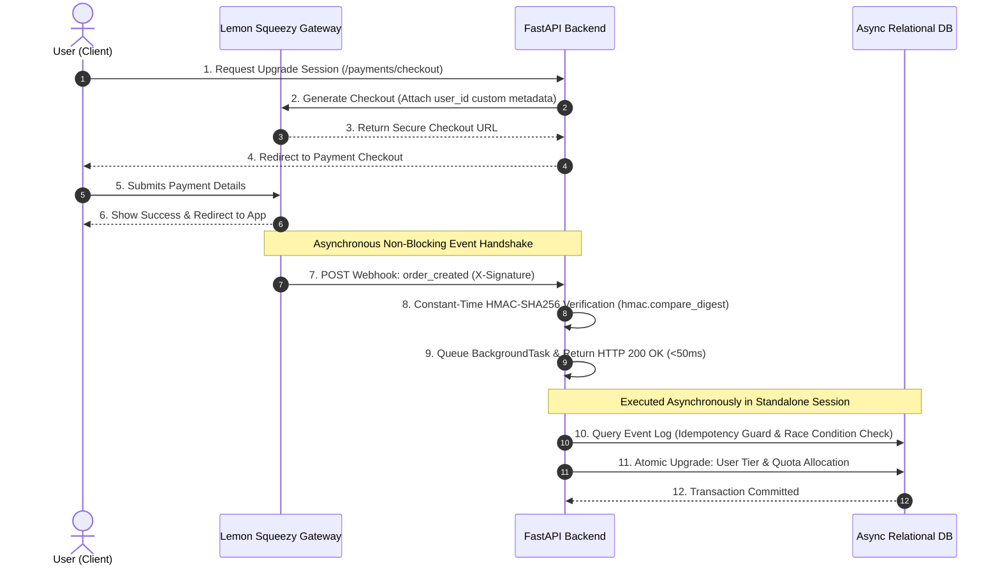
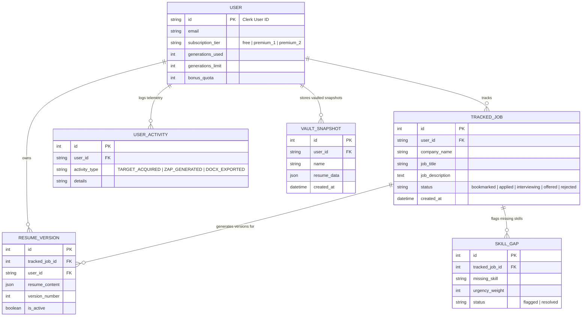

<div align="center">

# ⚡ResuMaxxing Architecture & System Design

> **The Industrial-Grade AI Career Engine**  
> *Automated, AI-driven career operating system designed for high-velocity resume tailoring, job application tracking, document roasting, and automated resume export.*

Designed & Engineered by **[Daikendy](https://github.com/daikendy)**


### 🛠️ Core Technology Stack & Infrastructure


<br/>


</div>

---


## 📌 Executive Summary & Architecture Overview

ResuMaxxing follows a decoupled **Client-Server & Micro-service Ready Architecture**:
- **Frontend Layer:** Built with **Next.js App Router**, React, TypeScript, **Tailwind CSS v4 (with tw-animate-css & Shadcn UI)**, Framer Motion, Zustand state management, and integrated with **Capacitor** for cross-platform deployment (Web, iOS, Android).
- **Backend Core:** Asynchronous **FastAPI** ASGI service operating on Python 3, utilizing **SQLAlchemy 2.0 (Async)** and **Alembic** for relational database migrations.
- **Identity & Authentication:** **Clerk Identity Platform** (JWT-based with decoupled RSA JWKS key caching & silent token decoding middleware).
- **AI Engine & Document Parsing:** Powered by **OpenAI API (GPT-4o & GPT-4o-mini)** for resume tailoring, roast evaluation, guest bullet optimization, and skill gap extraction. Integrated with **pdfplumber** and **python-docx** for parsing and document generation.
- **Database & Storage:** **MySQL / PostgreSQL** relational schema via `aiomysql` async driver for user profile quotas, resume version history, and tracked jobs telemetry.
- **Monetization & Webhooks:** **Lemon Squeezy API** payment webhooks with cryptographic HMAC SHA-256 signature verification and tiered access rules (`premium_1`, `premium_2`).

---

## 🏗️ High-Level System Architecture Diagram

```mermaid
flowchart TB
    %% Styling Definitions
    classDef client fill:#1e293b,stroke:#38bdf8,stroke-width:2px,color:#f8fafc;
    classDef gateway fill:#0f172a,stroke:#818cf8,stroke-width:2px,color:#f8fafc;
    classDef service fill:#1e1b4b,stroke:#c084fc,stroke-width:2px,color:#f8fafc;
    classDef infra fill:#1c1917,stroke:#f43f5e,stroke-width:2px,color:#f8fafc;

    subgraph CLIENT_LAYER ["📱 Client Layer (Cross-Platform)"]
        direction LR
        WEB["🌐 Next.js Web App (Tailwind CSS v4 + Zustand + Framer Motion)"]:::client
        MOBILE["📱 Mobile App (Capacitor iOS / Android)"]:::client
    end

    subgraph SECURITY_GATEWAY ["🛡️ Security, Gateway & Auth"]
        CLERK["🔐 Clerk Identity Platform (Auth & JWKS Provider)"]:::gateway
        GATEWAY["⚡ FastAPI Sentinel Gateway\n(CSP / CORS / 10MB Size Guard / SlowAPI Limiter)"]:::gateway
    end

    subgraph BACKEND_SERVICES ["⚙️ FastAPI Micro-Service Routers"]
        USER_SVC["👤 User Profile Router\n(/users/me)"]:::service
        RESUME_SVC["📄 Resume Engine & Generator\n(/resumes/generate, /guest-roast, /export-docx)"]:::service
        JOB_SVC["💼 Job Application Tracker\n(/jobs/, /extract-url)"]:::service
        PAYMENT_SVC["💳 Billing & Webhook Router\n(/webhooks/lemonsqueezy)"]:::service
    end

    subgraph INFRASTRUCTURE ["☁️ Data, Document & AI Infrastructure"]
        DB[("🗄️ Async Relational DB\n(MySQL / PostgreSQL + SQLAlchemy)")]:::infra
        AI_ENGINE["🤖 OpenAI Engine (GPT-4o / GPT-4o-mini)\n(Tailoring, Skill Gap, Roasting)"]:::infra
        DOC_TOOLS["📑 Document Processing Engine\n(pdfplumber PDF Extraction / python-docx Export)"]:::infra
        BILLING_GW["💰 Lemon Squeezy Gateway\n(Subscriptions & HMAC Webhooks)"]:::infra
    end

    %% Client Interactions
    WEB -->|"1. HTTPS / REST API"| GATEWAY
    MOBILE -->|"1. HTTPS / REST API"| GATEWAY
    WEB -.-|"Auth Handshake (Bearer JWT)"| CLERK
    MOBILE -.-|"Auth Handshake (Bearer JWT)"| CLERK

    %% Gateway & Auth Flow
    GATEWAY -->|"2. Local JWKS RSA Signature Verification"| CLERK
    GATEWAY -->|"3. Dispatch Authenticated Request"| USER_SVC
    GATEWAY -->|"3. Dispatch Authenticated Request"| RESUME_SVC
    GATEWAY -->|"3. Dispatch Authenticated Request"| JOB_SVC
    GATEWAY -->|"3. Dispatch Webhook Event"| PAYMENT_SVC

    %% Service to Persistence / External APIs / Doc Processing
    USER_SVC -->|"Sync User Quota & Profile"| DB
    JOB_SVC -->|"Track Jobs & Extract URLs"| DB
    RESUME_SVC -->|"Persist Resume Versions & Skill Gaps"| DB
    RESUME_SVC ==>|"AI Prompt Tailoring & Roasting"| AI_ENGINE
    RESUME_SVC ==>|"Parse PDFs / Generate DOCX"| DOC_TOOLS
    
    BILLING_GW ==>|"Signed HMAC SHA-256 Webhooks"| PAYMENT_SVC
    PAYMENT_SVC -->|"Update Subscription Tier & Quotas"| DB
```



---

## 🧠 AI Prompt Engineering & Guardrail Pipeline

ResuMaxxing enforces strict structural and anti-hallucination guardrails across all OpenAI model invocations:

1. **Strict JSON Schema Enforcement:**
   * All generative endpoints enforce structured outputs using `response_format={"type": "json_object"}` to guarantee deterministic response parsing.
2. **Exact 1-to-1 Input-to-Output Matching:**
   * Bullet customization algorithms strictly extract individual sentences/bullets from raw resumes and match the exact output count, prohibiting bullet merging or splitting.
3. **Anti-Hallucination & Vocabulary Constraints:**
   * System prompts explicitly forbid introducing unstated technologies, skills, or metrics. Synonym replacement is strictly bound to exact action matches in target job descriptions.
4. **Domain Isolation:**
   * Prompts prohibit converting domain-specific achievements (e.g., Frontend achievements into Backend achievements) to maintain resume authenticity.

---

## 💳 Enterprise Asynchronous Billing Architecture (Lemon Squeezy)

ResuMaxxing implements an event-driven, non-blocking payment processing architecture featuring **constant-time HMAC signature verification** and **idempotent asynchronous background workers**:



### Key Billing Architecture Safeguards:
- **Instant Webhook Acknowledgment (<50ms):** Returns `HTTP 200 OK` immediately after signature validation, deferring DB upgrades to FastAPI `BackgroundTasks` to prevent gateway retry timeouts.
- **Standalone Database Session Lifecycle:** Background tasks create independent `AsyncSessionLocal()` instances, avoiding dead-session bugs when HTTP request contexts terminate.
- **Strict Idempotency Guard:** Records event IDs prior to tier upgrades, ensuring duplicate webhooks or network retries are safely skipped without double-crediting user quotas.

---

## 🔒 Enterprise Privacy, GDPR Scrubbing & IDOR Isolation

1. **Automated GDPR Right-to-be-Forgotten (Svix Webhooks):**
   * Listens for Clerk `user.deleted` cryptographic webhooks (`/api/webhooks/clerk`). Upon verification via Svix, the system automatically triggers cascade deletions across all database tables (`delete_user`), purging user snapshots, activity telemetry, tracked jobs, and resume versions.
2. **Strict IDOR (Insecure Direct Object Reference) Prevention:**
   * Every database interaction enforces owner isolation at the SQL query level:
     ```python
     select(TrackedJob).filter(TrackedJob.id == job_id, TrackedJob.user_id == current_user["id"])
     ```
   * Malicious attempts to read, modify, or delete another user's job target or resume version return an immediate HTTP `404 Not Found`.

---

## 🎯 Feature Capability & System Architecture Mapping

The following matrix illustrates how user capabilities map directly to underlying API endpoints, processing engines, and infrastructure layers:

| Feature Capability | User Trigger | Target Endpoint | Infrastructure & Processing Engine |
| :--- | :--- | :--- | :--- |
| **Instant Guest Bullet Tailoring** | Guest Experience Input | `POST /resumes/guest-tailor` | `gpt-4o-mini` (Strict 1-to-1 sentence extraction) |
| **PDF Resume Roasting** | Public Upload Dropzone | `POST /resumes/guest-roast` | `pdfplumber` text/hyperlink extraction + AI Roast Engine |
| **Master Resume AI Tailoring** | Target Job Action | `POST /resumes/generate` | `GPT-4o` + Versioning Engine (`ResumeVersion`) |
| **Technical Skill Gap Analysis** | Job Tracking Hub | `POST /resumes/skill-gap` | Persistent Gap Engine (`SkillGap` model) |
| **Job Description URL Extraction** | Target URL Input | `POST /jobs/extract-url` | Async Scraper + BeautifulSoup Parser |
| **Editable DOCX Export** | Vault Export Action | `POST /resumes/{id}/export-docx` | `python-docx` buffer stream (Tier-guarded) |

---

## 📊 Entity-Relationship & Data Model Overview



---

## ⚡ Performance & High-Concurrency Design

1. **Decoupled JWKS Token Verification:**
   * Instead of making remote authentication calls per HTTP request, the backend warm-boots by fetching RSA public keys from Clerk once at startup and caches them. Token verification is executed locally in CPU microsecond speeds.
2. **Non-Blocking Telemetry & Activity Logging:**
   * Activity logs and telemetry events (`TARGET_ACQUIRED`, `ZAP_GENERATED`) are dispatched asynchronously, preventing database lock contention from delaying primary API responses.
3. **Optimized PDF Parsing:**
   * Text extraction during resume roasts avoids expensive vector-layout parsing steps, eliminating CPU freezes on complex PDF documents.
4. **Async Database Connections (`aiomysql`):**
   * Uses non-blocking asynchronous pool connections with SQLAlchemy 2.0 to handle high request concurrency without thread pool starvation.

---

## 🛡️ Rate Limiting & DoS Protection Matrix

To defend backend services against abusive requests and resource exhaustion, ResuMaxxing implements granular endpoint rate limiting via `SlowAPI` and payload byte-stream controls:

| Endpoint | Target Route | Rate Limit | Protection Strategy |
| :--- | :--- | :--- | :--- |
| **Guest Tailor** | `POST /resumes/guest-tailor` | `5 / min` | Public IP Rate Shield |
| **Guest Roast** | `POST /resumes/guest-roast` | `5 / min` | PDF Type Check + 10MB Stream Guard |
| **Resume Tailor** | `POST /resumes/generate` | `10 / min` | User ID Limiter + Quota Check + IDOR Guard |
| **DOCX Export** | `POST /resumes/{id}/export-docx` | `30 / min` | Subscription Tier Verification (`premium_1`/`premium_2`) |
| **Job Creation** | `POST /jobs/` | `30 / min` | Input Sanitization (`sanitize_text`, `sanitize_url`) |

---

## 🪵 Production Structured Telemetry & Observability Pipeline

ResuMaxxing implements production-grade structured logging via **`structlog`** (`logging_config.py`):
- **Structured JSON Logging:** Converts system events, latencies, and route exceptions into standardized ISO-timestamped JSON format for cloud log aggregators (Datadog, Grafana Loki, Railway Logs).
- **Silent Exception Sentinel:** Captures unhandled runtime errors globally, masking sensitive internal stack traces from production client HTTP responses while streaming full context logs internally.

---

## 🏛️ Master Vault & Snapshot State Engine

ResuMaxxing incorporates a dedicated **Vault Engine** (`vault_crud.py`) to manage versioning and data snapshots:
- **Immutable Snapshots (`VaultSnapshot`):** Users can save point-in-time snapshots of master resume states into JSON structures, allowing version comparisons and rollbacks.
- **Telemetry HUD (`ActivityLog`):** Non-blocking system telemetry captures user application velocity (`TARGET_ACQUIRED`, `TARGET_STATUS_UPDATED`, `ZAP_GENERATED`, `DOCX_EXPORTED`), rendering a real-time activity feed on the dashboard.

---

## 📱 Cross-Platform & Mobile Architecture (Capacitor)

ResuMaxxing is engineered to compile seamlessly into native mobile applications:
- **Unified Codebase:** Shared Next.js component layer utilized across Web and Mobile.
- **Native Capacitor Bridge:** Provides native access to device haptics (`@capacitor/haptics`), native file sharing (`@capacitor/share`), secure preferences storage (`@capacitor/preferences`), and document printing (`@capgo/capacitor-printer`).
- **Capacitor-Safe Content Security Policy:** Dynamic CSP middleware accommodating `capacitor://localhost` (iOS) and `http://localhost` (Android) origins with strict frame-ancestor shielding (`DENY`).

---

## 🛠️ Technology Stack Breakdown

| Layer | Technology | Purpose |
| :--- | :--- | :--- |
| **Frontend Framework** | **Next.js (App Router)** | Server & Client Components, SSG/SSR hybrid rendering |
| **Mobile Runtime** | **Capacitor** | Native bridging for Android & iOS builds |
| **Styling & UI** | **Tailwind CSS v4 + Shadcn UI + Framer Motion** | Utility-first design system with smooth micro-animations |
| **State Management** | **Zustand** | Lightweight reactive client-side store |
| **Backend Framework** | **FastAPI (Python 3)** | High-concurrency async ASGI web server |
| **ORM & Database** | **SQLAlchemy 2.0 (Async) + Alembic** | Async database access & migrations via `aiomysql` |
| **Authentication** | **Clerk Auth** | Passwordless, OAuth, JWKS JWT decoding |
| **AI Integration** | **OpenAI API (GPT-4o & GPT-4o-mini)** | Automated resume restructuring, roasting & skill gap analysis |
| **Document Engine** | **pdfplumber & python-docx** | PDF text/hyperlink extraction & DOCX resume generation |
| **Logging & Telemetry** | **Structlog (JSON Logging)** | Structured production logging & ISO context rendering |
| **Rate Limiting** | **SlowAPI / Redis Ready** | IP and User ID based API rate throttling |
| **Billing Integration**| **Lemon Squeezy API & Svix Webhooks** | Subscription tiering (`premium_1`, `premium_2`) & HMAC events |

---

## 🗺️ High-Level API Domain Map

```
/
 ├── /users
 │    ├── GET  /me                      # Sync user profile & fetch quota
 │    └── PUT  /me                      # Update master profile details
 ├── /resumes
 │    ├── POST /guest-tailor            # Rate-limited public bullet customization
 │    ├── POST /guest-roast             # Parse PDF & generate resume roast
 │    ├── POST /generate                # Tailor master resume for tracked job
 │    ├── POST /skill-gap               # Deep technical skill gap analysis
 │    └── POST /{id}/export-docx        # Export resume version as editable DOCX (Premium)
 ├── /jobs
 │    ├── GET  /                        # List user tracked jobs with resume versions
 │    ├── POST /                        # Track new job application target
 │    ├── POST /extract-url             # Auto-extract job description from URL
 │    ├── PATCH /{id}                   # Update stage (Bookmarked, Applied, Interview)
 │    └── DELETE /{id}                  # Delete tracked job & related versions
 └── /webhooks
      └── POST /lemonsqueezy            # Handle Lemon Squeezy subscription webhooks
      └── POST /clerk                   # Process Svix signed user deletion webhooks
```

---

## 💡 Architecture Strategy: Public Spec & Private Implementation

### Standard Strategy for Public Technical Overview Repositories
Creating a dedicated public repository for system architecture, RFCs, and API specifications while preserving source code privacy in a separate repository is an **industry-standard practice**.

#### Key Advantages:
1. **IP Protection:** Keeps proprietary core algorithms, AI prompts, business logic, and code assets private.
2. **Public Transparency & Showcase:** Enables developers, investors, and potential clients to evaluate system design, architecture standards, and security without exposing full execution code.
3. **Collaborative Design Reviews:** Facilitates public RFC discussions, design review issues, and documentation updates open to public contributions.

#### Best Practices for Public Architecture Repositories:
- ❌ **Do NOT include:** Private API keys, database credentials, internal service domain names, or secrets (`.env` files).
- ❌ **Do NOT include:** Full raw prompt files containing proprietary IP.
- ✅ **DO include:** High-level diagrams (Mermaid format), data flow diagrams, system requirements, tech stack specs, and general API contracts.

---

*Architected & Developed with precision by [Daikendy](https://github.com/daikendy)*
